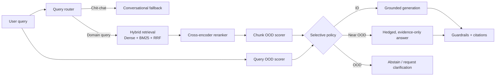

**OOD Aware RAG: Confidence Calibrated Generation**
> A retrieval-augmented generation system that knows when its evidence is outside its trusted knowledge domain — and responds by answering, hedging, or abstaining instead of confidently guessing wrongly.

Most RAG systems answer every query the same way: retrieve, stuff into a prompt, generate. If the corpus doesn't actually cover the question, the model still confidently generates something — because nearest-neighbor retrieval always returns something, whether or not it's relevant. This project treats that as the real hallucination problem worth solving: rather than trusting retrieval blindly, every query and every retrieved chunk is scored against a statistically fitted reference distribution of the trusted corpus, using the same distributional-distance techniques (Mahalanobis distance, kNN density, energy-based scoring) used for out-of-distribution detection in computer vision. When a query falls outside that distribution, the system says so explicitly instead of guessing.
This prevents the LLM from hallucinating and fabricating false/irrelevant answers.

## Why it matters

| Standard RAG failure | OOD-Aware RAG response |
| --- | --- |
| An unrelated question still retrieves superficially similar text | Score the **query** against the trusted corpus before trusting retrieval |
| A nearest-neighbour result looks relevant but is statistically atypical | Score each retrieved chunk using global and local embedding-space signals |
| The model has insufficient evidence but generates anyway | Select `generate`, `hedge`, or `abstain` based on the OOD policy |
| Confidence is hidden behind a hard decision | Return calibrated `P(OOD)`, an empirical confidence interval, and an OOD band |
| A corpus changes or its scope is incomplete | Use high-OOD traffic as a measurable signal for corpus gaps and drift |

This is especially useful for research assistants, internal knowledge bases, regulated-domain copilots, and any RAG application where an honest *“this corpus does not cover that”* is safer than an elegant fabrication.

## System architecture



## Repository layout

```text
.
├── build_index.py          # Build Chroma text/image indexes from the corpus manifest
├── hybrid_retrieval.py     # Dense + BM25 + RRF + cross-encoder retrieval
├── ood_scoring.py          # Fit, evaluate, save, load, and score OOD references
├── query_router.py         # Chit-chat vs corpus-routing decision
├── agent.py                # End-to-end selective RAG orchestrator
├── guardrails.py           # Prompt-injection flags, grounding, citations, reproducibility
├── generator.py            # Extractive and OpenAI-compatible generators
├── app.py                  # FastAPI service and frontend entry point
├── corpus_selection.py     # Corpus construction / tier selection
├── corruptions.py          # Controlled corruption utilities
├── eval_retrieval.py       # Retrieval ablations and tier-precision evaluation
└── test_ood_scoring.py     # OOD scoring tests
```

## Quick start

### 1. Clone and create an environment

```bash
git clone <YOUR-REPOSITORY-URL>
cd RAG-OOD

python -m venv .venv
source .venv/bin/activate       # Windows PowerShell: .venv\Scripts\Activate.ps1
python -m pip install --upgrade pip
pip install chromadb sentence-transformers rank-bm25 fastapi "uvicorn[standard]" python-dotenv pillow
```

The first run downloads the embedding and reranking models used by the prototype:

- `all-MiniLM-L6-v2` for text embeddings
- `cross-encoder/ms-marco-MiniLM-L-6-v2` for reranking

### 2. Build the vector index

If you are using the included corpus, build the index with:

```bash
python build_index.py --corpus ./corpus --index ./chroma_index
```

`build_index.py` expects `corpus/manifest.json` entries with `tier`, `modality`, `path`, `title`, and `source` fields. Text tiers should include a trusted `id_core_text`, which is a set of in-domain documents; optional `near_ood_*` and `far_ood_*` tiers enable probability calibration and evaluation.

### 3. Fit and evaluate the OOD reference

```bash
python ood_scoring.py \
  --index ./chroma_index \
  --collection text_chunks \
  --query_ref ./query_reference.json \
  --output ./ood_reference.npz
```

This fit an enery-based model (Gaussian mixture model) on the set of in-domain distributions, which helps in identifying queries or documents that are out-of-distribution. By default, the fit process holds out 10% of each ID/OOD tier and reports energy and kNN AUROC. Set `--eval-fraction 0` only when you explicitly want to fit on all available labelled data.

### 4. Inspect confidence-aware retrieval

```bash
python hybrid_retrieval.py \
  --index ./chroma_index \
  --ood-reference ./ood_reference.npz \
  --query "How does domain generalization handle distribution shift?"
```

Try an obviously off-topic prompt to verify the failure-safe path:

```bash
python hybrid_retrieval.py \
  --index ./chroma_index \
  --ood-reference ./ood_reference.npz \
  --query "What is a good recipe for vegetarian lasagna?"
```

### 5. Run the end-to-end agent

The extractive backend needs no API key and is useful for validating the complete policy flow:

```bash
python agent.py \
  --index ./chroma_index \
  --ood-reference ./ood_reference.npz \
  --generator extractive \
  --query "Explain invariant risk minimization."
```

For interactive chat, omit `--query`.

To use an OpenAI-compatible endpoint, create a local `.env` file:

```bash
OPENAI_API_KEY=your_key_here
# Optional: Ollama, vLLM, Groq, or another OpenAI-compatible endpoint
# OPENAI_BASE_URL=https://api.openai.com/v1
```

Then use `--generator openai`.
