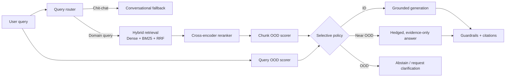

**OOD Aware RAG: Confidence Calibrated Generation**

Most RAG systems answer every query the same way: retrieve, stuff into a prompt, generate. If the corpus doesn't actually cover the question, the model still confidently generates something — because nearest-neighbor retrieval always returns something, whether or not it's relevant. This project treats that as the real hallucination problem worth solving: rather than trusting retrieval blindly, every query and every retrieved chunk is scored against a statistically fitted reference distribution of the trusted corpus, using the same distributional-distance techniques (Mahalanobis distance, kNN density, energy-based scoring) used for out-of-distribution detection in computer vision. When a query falls outside that distribution, the system says so explicitly instead of guessing.
This prevents the LLM from hallucinating and fabricating false/irrelevant answers.

## Why it matters

| Standard RAG failure | OOD-Aware RAG response |
| --- | --- |
| An unrelated question still retrieves superficially similar text | Score the **query** against the trusted corpus before trusting retrieval |
| A nearest-neighbour result looks relevant but is statistically atypical | Score each retrieved chunk using global and local embedding-space signals |
| The model has insufficient evidence but generates anyway | Select `generate`, `hedge`, or `abstain` based on the OOD policy |
| Confidence is hidden behind a hard decision | Return calibrated `P(OOD)`, an empirical confidence interval, and an OOD band |
| A corpus changes or its scope is incomplete | Use high-OOD traffic as a measurable signal for corpus gaps and drift |

This is especially useful for research assistants, internal knowledge bases, regulated-domain copilots, and any RAG application where an honest *“this corpus does not cover that”* is safer than an elegant fabrication.

## System architecture

